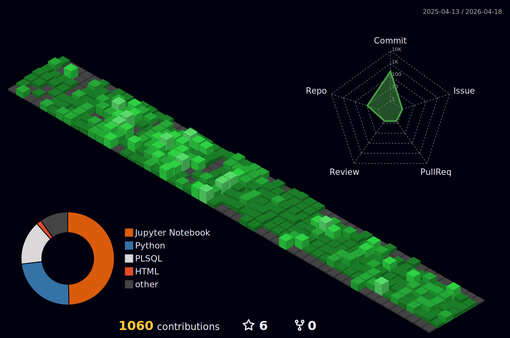

# ⚙️ Engenheiro de Dados | Oracle SQL | GCP | Microsoft Fabric

Engenheiro de Dados com atuação em **SQL de alta performance**, **engenharia de dados em cloud** e **automação de processos (RPA)**.  
Experiência em ambientes orientados a dados, performance, confiabilidade e escalabilidade.

## 💡 Competências Técnicas
- SQL Performance, Tuning e Desenvolvimento (Oracle)
- Engenharia de Dados no Google Cloud Platform (GCP)
- Engenharia de Dados no Microsoft Fabric
- Automação de Processos (RPA)
- Desenvolvimento em Python para dados e automações

## 📈 Atividade no GitHub

  

## 📌 Projetos & Estudos

- 🛢️ **[MongoDB Monitoring com Python](https://github.com/gustavolima007/mongodb-monitoring)**  
  Monitoramento de aplicações em Python com integração ao MongoDB, foco em coleta de métricas, observabilidade e boas práticas.

- 🐍 **[Python Lab](https://github.com/gustavolima007/python-lab-gl)**  
  Laboratório de estudos em Python, abordando fundamentos, automações e organização de código.

- 📊 **[Power BI Lab](https://github.com/gustavolima007/powerbi-lab-gl)**  
  Estudos em Power BI com foco em modelagem de dados, DAX e visualização analítica.

- 🌍 **[English Tech Fluency](https://github.com/gustavolima007/english-tech-fluency)**  
  Estudos contínuos de inglês técnico aplicado à tecnologia e documentação.

- 🎓 **[Especialização em Engenharia de Banco de Dados – UNICAMP](https://github.com/gustavolima007/Unicamp_Engenharia-banco-de-dados)**  
  Materiais e estudos relacionados à pós-graduação em Engenharia de Banco de Dados.

- 🤖 **[Bootcamp Heineken – IA Aplicada a Dados com Copilot](https://github.com/gustavolima007/Bootcamp_Heineken-IA-Aplicada-a-Dados-com-Copilot)**  
  Projetos e estudos voltados à aplicação de IA no contexto de dados, com apoio do GitHub Copilot.

## ⚡ Contribuições no GitHub

## 🌐 Contatos

