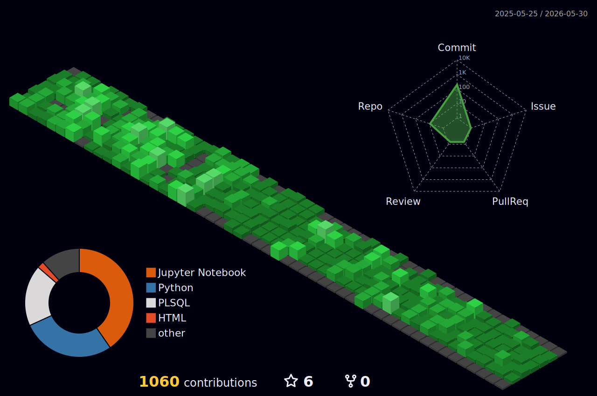

# ⚙️ Especialista Oracle Database | Desenvolvedor PL/SQL | Tuning & Performance

Especialista em Banco de Dados focado em  **alta performance** , **sustentação de infraestrutura crítica** e  **automações complexas** . Pós-graduado pela  **Unicamp**, atuo na otimização de ecossistemas Oracle, MongoDB e PostgreSQL

## 💡 Competências Técnicas

* **Oracle Database:** PL/SQL Avançado (Packages, Procedures, Triggers), Tuning & Performance.
* **Sustentação:** Backup & Recovery e Administração.

  

## 📌 Projetos & Estudos

- 🛢️ **[MongoDB Monitoring com Python](https://github.com/gustavolima007/mongodb-monitoring)**Monitoramento de aplicações em Python com integração ao MongoDB, foco em coleta de métricas, observabilidade e boas práticas.
- 🐍 **[Python Lab](https://github.com/gustavolima007/python-lab-gl)**Laboratório de estudos em Python, abordando fundamentos, automações e organização de código.
- 📊 **[Power BI Lab](https://github.com/gustavolima007/powerbi-lab-gl)**Estudos em Power BI com foco em modelagem de dados, DAX e visualização analítica.
- 🌍 **[English Tech Fluency](https://github.com/gustavolima007/english-tech-fluency)**Estudos contínuos de inglês técnico aplicado à tecnologia e documentação.
- 🎓 **[Especialização em Engenharia de Banco de Dados – UNICAMP](https://github.com/gustavolima007/Unicamp_Engenharia-banco-de-dados)**Materiais e estudos relacionados à pós-graduação em Engenharia de Banco de Dados.
- 🤖 **[Bootcamp Heineken – IA Aplicada a Dados com Copilot](https://github.com/gustavolima007/Bootcamp_Heineken-IA-Aplicada-a-Dados-com-Copilot)**
  Projetos e estudos voltados à aplicação de IA no contexto de dados, com apoio do GitHub Copilot.

## ⚡ Contribuições no GitHub

## 🌐 Contatos

